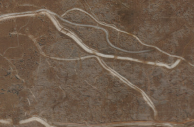
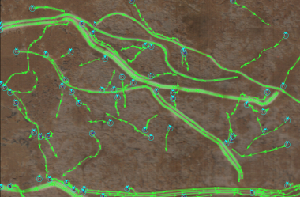

rhizoTrak  is
- an open source  tool for flexible and efficient manual annotation 
	of complex time-series minirhizotron images,
- building on <a href="https://imagej.net/TrakEM2">TrakEM2</a>,
- realized as a Fiji plugin available for Windows, Linux, and MacOS.

rhizoTrak  News
- current release is 1.1, see [Documentation](pages/docs) 
	for more details

rhizoTrak  features 
- import and processing of the complete set of images of a time series in one single project
-  easy browsing through time points which  enables to annotate roots by simultaneously 
	considering images of different time points 
- temporal links between roots in different
images which  explicitly represented identity of the same physical root via so-called connectors
- easy transfer of annotation data of one time point to the next
 as initial annotation where
	connectors between corresponding root annotations are automatically established
- automatic checks for inconsistencies in root typology due to merging of roots
	and assistance in solving them
- the inherent representation of branching roots by modeling roots as treelines
- an individual radius for each node of a treeline, and 
	user-definable status labels for segments of treelines 
- a large collection of editing operations for root treelines including split and merge, 
	where many of these operations are easily accessible via keyboard shortcuts
- different visualization options for treelines and fast hiding and un-hiding of all 
	annotated treelines
- redirection of treelines which is important as the upstream and downstream of a root is often not straightforward to be identified in minirhizotron images
-  import
and export of annotations from/to [RSML format](http://rootsystemml.github.io/), 
- export of root measurements in a tab-separated format including the option to aggregate
	measurements within images
- a plugin mechanism to merge results from automatic segmentation method which
  are to be implemented as a [MiToBo](http://www.informatik.uni-halle.de/mitobo) operator 

rhizoTrak includes: 
- the R [rhizoTrakAddons](pages/devel#Rpackage) package to assist in analyzing and processing csv files generated by rhizoTrak

<h4>Sample image  and annotation</h4>

rhizoTrak is developed 

* by the [Bioinformatics and Pattern Recognition](https://www.informatik.uni-halle.de/arbeitsgruppen/mustererkennung/)
	at the Institute of Computer Science, Martin Luther University Halle/Wittenberg, Germany   
* in cooperation with the research group 
	[Systematic Botany and Functional Biodiversity](https://biologie.lw.uni-leipzig.de/en/institut/ag/systematic-botany-and-functional-biodiversity/), 
	Institute of Biology, Leipzig University, Germany

